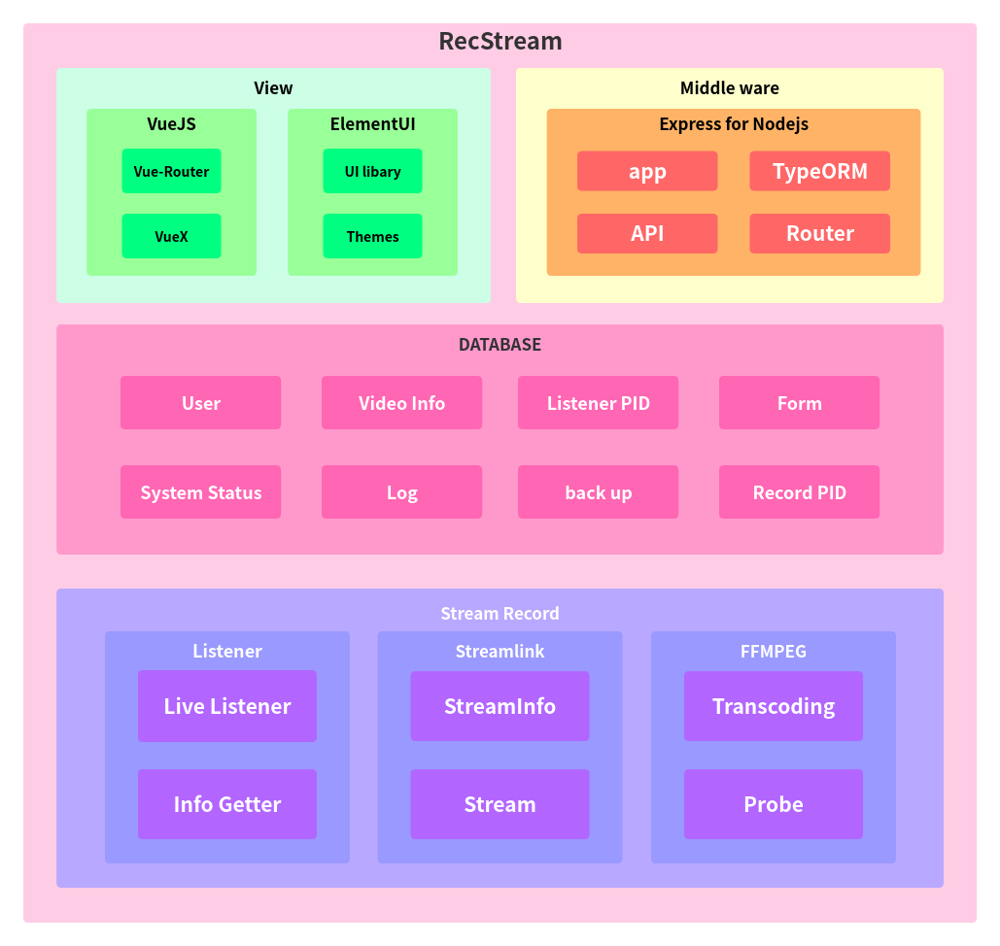

# RecStream 系统框架

RecStream 由**View（视图）**，**Middle Ware（中间件）**，**DATABASE（数据库）**和**Stream Recode（流录制）**四层相对独立的结构组成。

<small>RecStream 是一款全部基于应用层设计的系统，因此整体架构中不涉及任何硬件以及网络结构体系。</small>

## View

**View**层，即视图，是系统与用户进行直接交互的结构单元。

View采用 `Vuejs` 框架进行设计开发，`Vue-Router` 负责Web的路由功能，`Element UI` 进行整体UI风格设计。

## Middle Ware

**Middle Ware**，即中间件，是 **View** 与 **DATABASE** 之间数据交换的桥梁。

Middle Ware包括以下四个子模块：

- **APP**
- **ORM**
- **API**
- **Router**

Middle Ware整体以 `Express` 框架进行设计开发。

### APP

**APP**，即application，为Middle Ware的应用主体。

### ORM

**ORM**，即Object Relational Mapping，为APP与DATABASE进行数据交互的桥梁。

ORM以类的方式对DATABASE中的表结构进行映射，通过对实例化对象的操作来操作DATABASE。

### API

**API**，即Application Programming Interface，为View提供接口与DATABASE进行数据交互。

Middle Ware主要提供基于HTTP/HTTPS请求的Web应用接口，支持GET/POST方法的请求方式。

### Router

**Router**，为API和View提供路由。

## DATABASE

**DATABASE**，即数据库。RecStream的所有应用配置等数据均保存在数据库中。

数据库中的表结构分为两大部分：

- 系统表  / System Tables
- 用户表 / User Tables

### 系统表 / System Tables

#### Log

存储系统日志

> - ***Date***: 日期
> - Msg: 日志信息

#### back up

存储备份数据

> - ***Date***: 日期
> - Path:  备份文件路径

#### System Status

存储系统状态信息

> - ***status***: 系统状态
> - description: 描述

### 用户表 / User Tables

#### User

存储用户信息

> - ***username***: 用户名
> - password: 密码
> - MD5: 登陆识别码

#### VideoInfo

存储录制视频信息

> - ***id***: 视频编号
> - Size: 视频大小
> - Title: 视频标题
> - Resolution: 分辨率

#### Listener

存储监听器的PID信息

> - ***PID***: 监听器PID
> - LiveURL: 直播URL
> - Status: 监听器状态

#### Recorder

存储录制器的PID信息

> - ***PID***: 录制器PID
> - LiveURL: 直播URL
> - LiveURL: 录制器状态

## Stream Record

**Stream Record**是RecStream的核心组件，负责核心的直播录制功能。

Stream Record包含三个子组件：

- Listener
- Streamlink
- FFMPEG

详细说明请查看对应词条。

### Listener

Listener负责直播流的监听（**Live Listener**）以及流参数的获取（**Info Getter**）。

### Streamlink

Streamlink主要负责直播流的识别（**Stream Info**），截取和存储（**Stream**）。

### FFMPEG

FFMPEG主要负责直播流数据的编码，转码（**Transcoding**）以及存储视频参数的获取（**Probe**）。